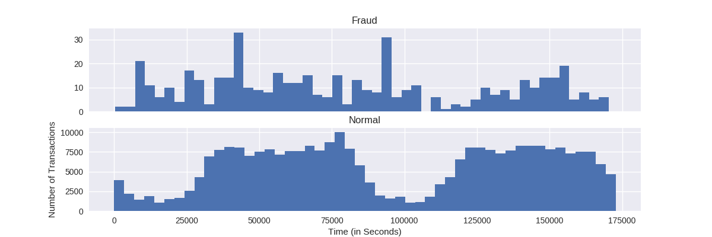

# Predicting Credit Card Fraud

In this article, I will be using the free and open source "[Credit Card Fraud Detection](https://www.kaggle.com/dalpozz/creditcardfraud)" dataset found on Kaggle.

The dataset is in CSV format and contains transactions made by credit cards in September 2013 by European cardholders. This dataset presents transactions that occurred in two days, where we have 492 frauds out of 284,807 transactions. The dataset is highly unbalanced; the positive class (frauds) account for 0.172% of all transactions.

It contains only numerical input variables which are the result of a PCA transformation. Due to confidentiality issues, the authors of the dataset cannot provide the original features and more background information about the data. Features V1, V2, ... V28 are the principal components obtained with PCA (aka "anonymized features"), the only features which have not been transformed with PCA are "Time" and "Amount". Feature "Time" contains the seconds elapsed between each transaction and the first transaction in the dataset. The feature "Amount" is the transaction amount (this feature can be used for example-dependant cost-senstive learning). Feature "Class" is the response variable and it takes value 1 in case of fraud and 0 otherwise (note: I will be renaming this feature to "Fraud" later on in the analysis).

The goal for this analysis is to predict credit card fraud in the transactional data. I will be using TensorFlow to build the predictive model, and t-distributed stochastic neighbor embedding (t-SNE) to visualize the dataset in two dimensions.

I will also use [Amazon Machine Learning](https://aws.amazon.com/machine-learning/) (Amazon ML) tools and services and provide comparisons against TensorFlow and t-SNE. If I have time, I will also use the [Google Cloud Machine Learning Engine](https://cloud.google.com/ml-engine/) (Google ML).

## Prerequisites

For the non-Amazon ML and Google ML analysis, I will be using Python with the following Python modules:
* [Pandas](http://pandas.pydata.org) &mdash; Powerful data structures for data analysis, time series,and statistics.
* [NumPy](http://www.numpy.org)  &mdash; Array processing for numbers, strings, records, and objects.
* [TensorFlow](http://tensorflow.org/)
* [sklearn](https://pypi.python.org/pypi/scikit-learn/) &mdash; A set of python modules for machine learning and data mining.
* [seaborn](http://stanford.edu/~mwaskom/software/seaborn/) &mdash; Statistical data visualization.
* [matplotlib](http://matplotlib.org) &mdash; Python plotting package.

## Exploring the data

* Load the dataset:
```
df = pd.read_csv("data/creditcard-train.csv")
```

Below are what the first 5 entries (or lines) in the dataset with the V3..V27 feature/columns removed for formatting reasons:

```
df.head()
```
| Time | V1        | V2        | .. | V28       | Amount | Class |
|-----:|----------:|----------:|----|----------:|-------:|------:|
| 0.0  | -1.359807 | -0.072781 | .. | -0.021053 | 149.62 | 0     |
| 0.0  |  1.191857 |  0.266151 | .. |  0.014724 |   2.69 | 0     |
| 1.0  | -1.358354 | -1.340163 | .. | -0.059752 | 378.66 | 0     |
| 1.0  | -0.966272 | -0.185226 | .. |  0.061458 | 123.50 | 0     |
| 2.0  | -1.158233 |  0.877737 | .. |  0.215153 |  69.99 | 0     |

* Get some basic information about the dataset:
```
df.describe()
print df.Time[df.Class == 0].count() # => 284315 normal transactions
print df.Time[df.Class == 1].count() # => 492 fraud transactions
print df.Time.count() # => 284807 total transactions (normal + fraud)
```

* Check for any missing values:
```
df.isnull().sum()
```
All columns show zero null fields. Thus, there are no missing values, which is what we want.


* Compare the Time feature/fields across fraudulent and normal transactions:
```
f, (ax1, ax2) = plt.subplots(2, 1, sharex=True, figsize=(12,4))

bins = 50

ax1.hist(df.Time[df.Class == 1], bins = bins)
ax1.set_title('Fraud')

ax2.hist(df.Time[df.Class == 0], bins = bins)
ax2.set_title('Normal')

plt.xlabel('Time (in Seconds)')
plt.ylabel('Number of Transactions')

plt.savefig("images/num_transactions_v_time.png")
```


# Glossary
__TensorFlow__ is an open source software library for machine learning across a range of tasks, and developed by Google to meet their needs for systems capable of building and training neural networks to detect and decipher patterns and correlations, analogous to the learning and reasoning which humans use.

__t-distributed stochastic neighbor embedding (t-SNE)__ is a machine learning algorithm for dimensionality reduction. It is a nonlinear dimensionality reduction technique that is particularly well-suited for embedding high-dimensional data into a space of two or three dimensions, which can then be visualized in a scatter plot. Specifically, it models each high-dimensional object by a two- or three-dimensional point in such a way that similar objects are modeled by nearby points and dissimilar objects are modeled by distant points.

# Sources
* Andrea Dal Pozzolo, Olivier Caelen, Reid A. Johnson, and Gianluca Bontempi (2015). "[Calibrating Probability with Undersampling for Unbalanced Classification](http://ieeexplore.ieee.org/document/7376606)". _In Symposium on Computational Intelligence and Data Mining (CIDM)_, IEEE. DOI: 10.1109/SSCI.2015.33
* Kaggle: [Credit Card Fraud Detection](https://www.kaggle.com/dalpozz/creditcardfraud) &mdash; Anonymized credit card transactions labeled as fraudulent or genuine.
